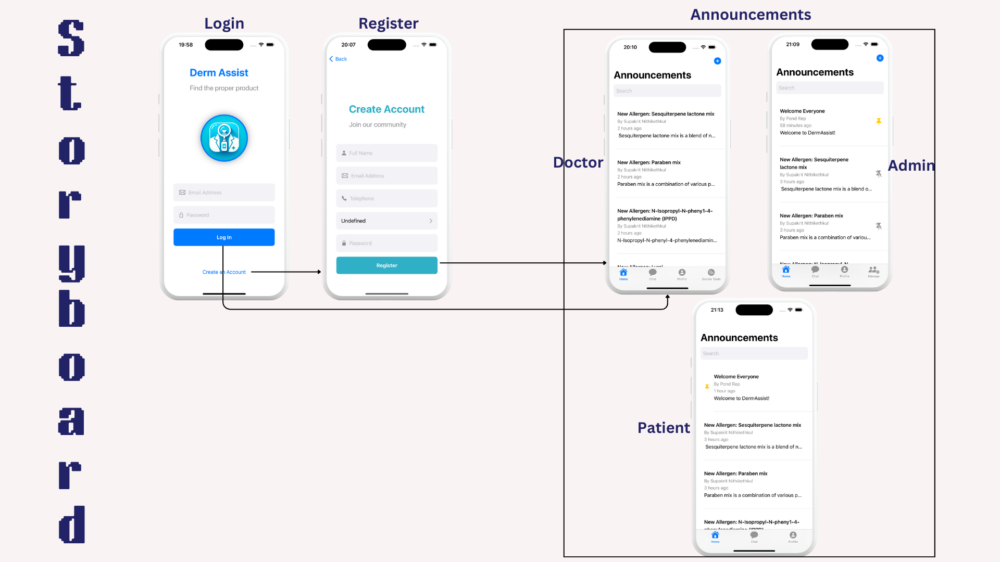
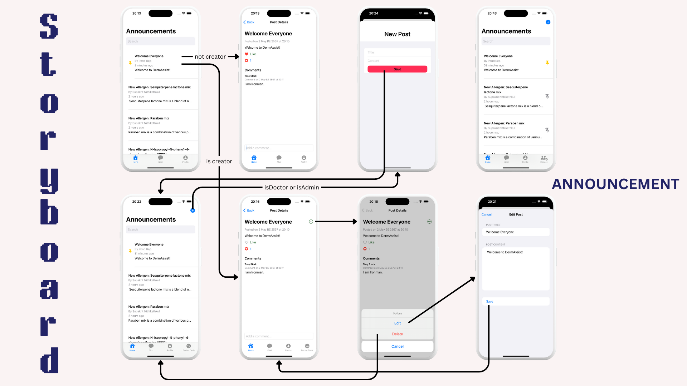
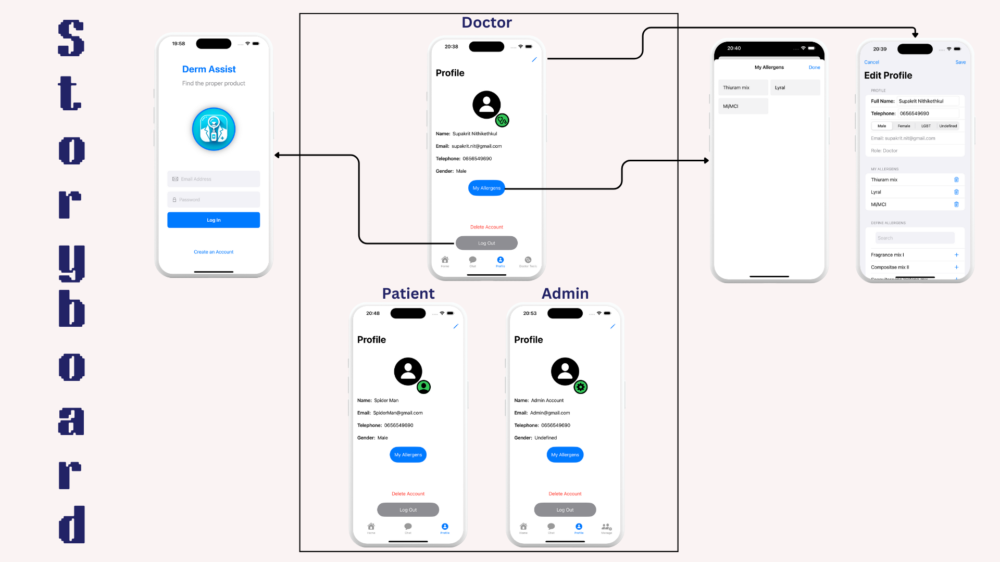

# DermAssist

DermAssist is a comprehensive dermatology assistance app built using SwiftUI. It offers a range of features from user authentication to in-depth management tools for dermatology professionals. This app facilitates patient communication, data management, and educational tools in a user-friendly environment.

### member
Supakrit Nithikethkul 6410615139
Thammasat Thonggamgaew 6410685033

## Features

- **User Authentication**: Secure login and registration functionality.
- **Profile Management**: Users can view and edit their profiles, managing personal information and medical details.
- **Announcement Board**: A section for users to post and interact with community content.
- **Chat System**: Enables real-time communication among users.
- **Doctor Tools**: Specialized tools for dermatology professionals, including product management and allergen tracking.
- **Admin Panel**: Administrative tools for managing user roles, posts, and more.

## Installation

Clone the repository to your local machine:

bash
git clone https://github.com/6410685033/DermAssist.git

Navigate to the project directory:

bash
cd DermAssist

Open the project in Xcode:

bash
open DermAssist.xcworkspace

Run the project in Xcode or use the command line:

bash
xcodebuild -scheme DermAssist

## Usage

1. **Login/Register**: Start by creating an account or logging in.
2. **Navigate through the Tab Bar**: Explore different features like Announcements, Chat, Profile, and Doctor Tools.
3. **Interact with Posts**: Create, edit, like, or comment on posts.
4. **Manage Profile**: Update personal and medical information.

## Architecture overview

- SwiftUI
- Firebase for backend services
- overpass-api

## Storyboard

#### Start

#### Announcement

#### Chat

#### Profile

#### Doctor Tools

#### Admin Manage

